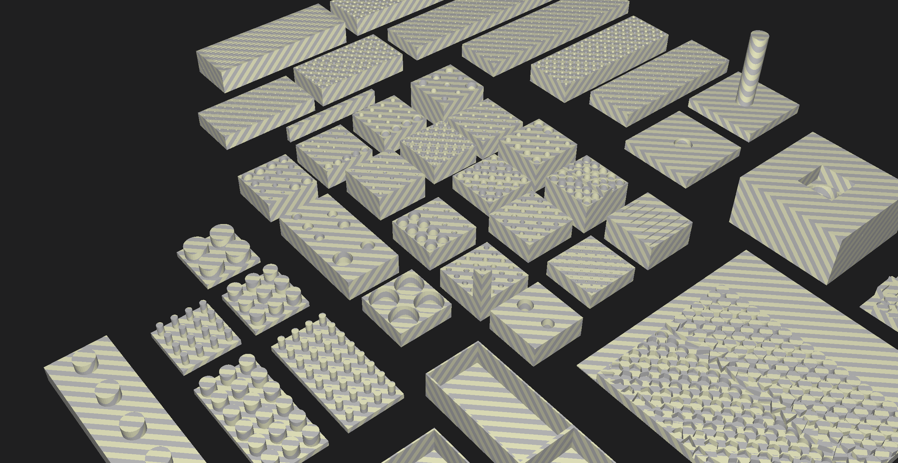
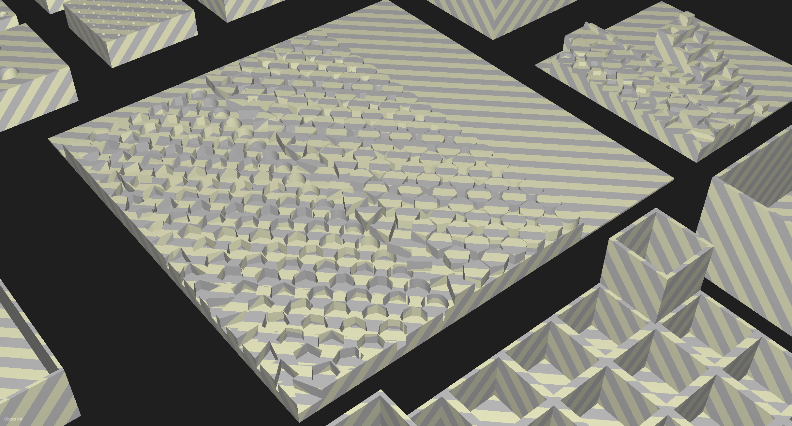
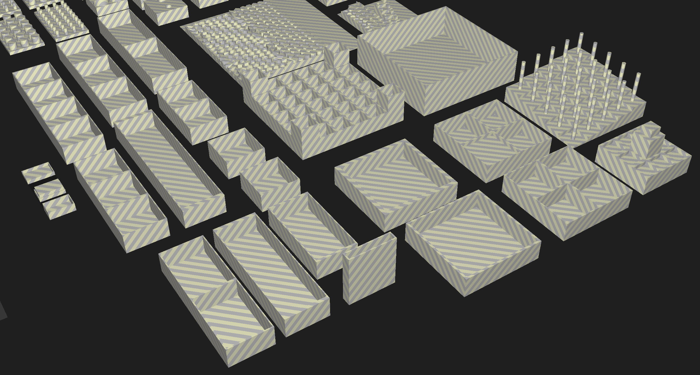

# Parametric Organizer

https://www.thingiverse.com/thing:4914021

https://github.com/lexblagus/ParametricOrganizer

## Summary

Parametric holder organizer for any collection you can name: tools (bits, tips, discs), makeup (lipstick, eyeshadows), paiting (brushes, tints) etc.

## Requirements

- NodeJS >= 14;
- Bash interpreter (Mac and Linux);
- [OpenSCAD](https://openscad.org/);

## Generator

`./run.sh` to generate files. This may take a long time depending on how much combinations you created.

## Examples

In the foldert `generator/models` will will find several examples based on my personal needs.

- boxes with caps
- perfured blocs for workshop:
  - batteries AA and AAA
  - screw bits
  - dremel tips
- drills
- drawer organizers

