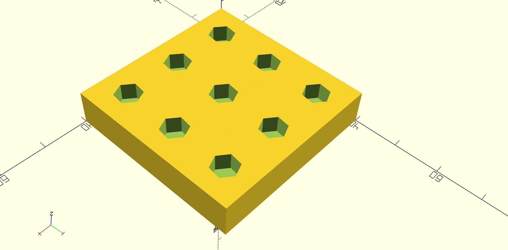
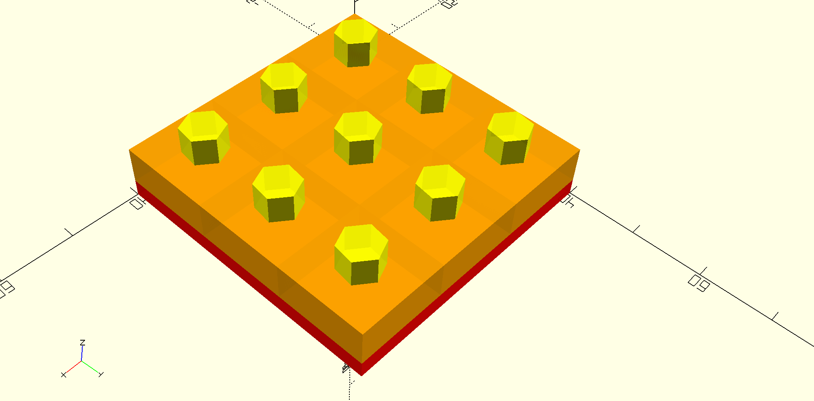
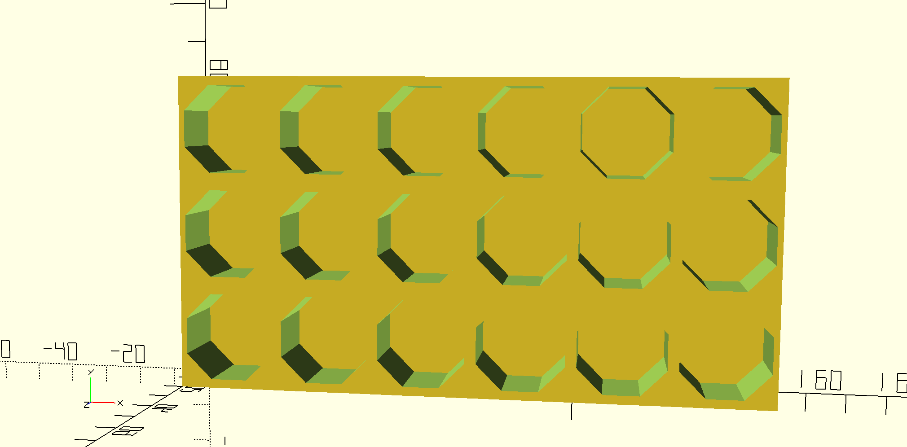
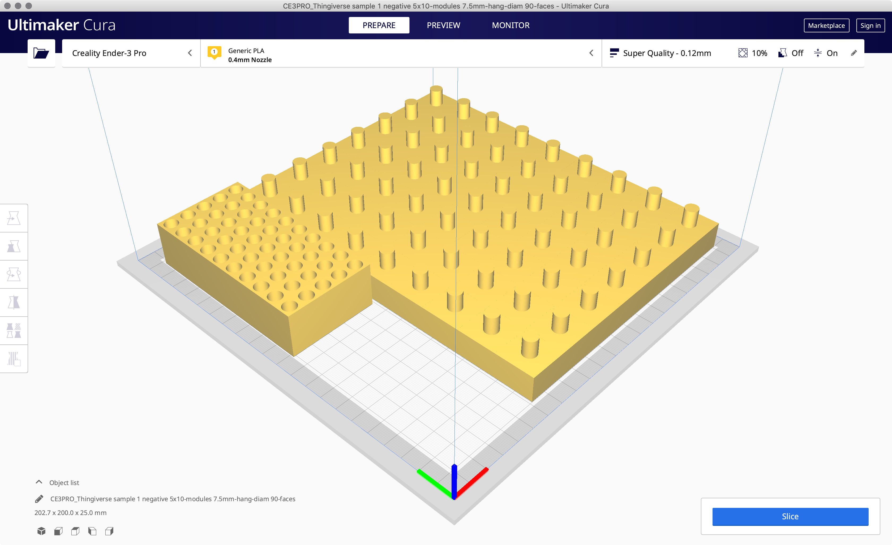
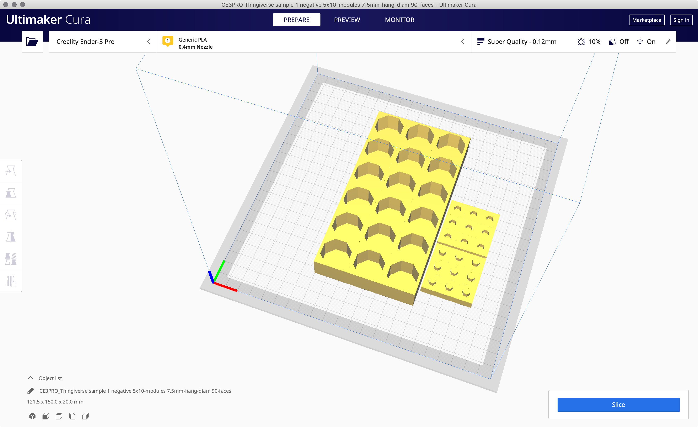

# Parametric Organizer

https://www.thingiverse.com/thing:4914021

https://github.com/lexblagus/ParametricOrganizer

## Summary

Parametric holder organizer for any collection you can name: tools (bits, tips, discs), makeup (lipstick, eyeshadows), paiting (brushes, tints) etc.

## Requirements

- OpenSCAD
- Slicer software (like Cura or PrusaSlicer)
- 3D Printer

### Generator

- NodeJS >= 14;
- Bash interpreter (Mac and Linux)

## Parameters

- `Outer_shell_width`: main object width
- `Outer_shell_length`: main object length 
- `Outer_shell_height`: main object height
- `Min_floor_height`: minimum floor height (for negative objects)
- `Modules`: quantity of elements per columns then per rows
- `Hang_depth_height`: hanger (hole or pin) height. negative = hole depth, positive = pin height. 
- `Hang_diameter`: hanger diameter. Diagonal length for 4 faces objects
- `Hang_faces`: 3 to render triangles, 4 to render squares, or use more than 36 for rouded 
- `Hang_rotation`: rotate the hanger, usefull for 3 to 8 faces

## Generator

At folder `generator` you can find the script to generate several files at once:

- Edit `generator/models.js` as you wish;
- Run `./run.sh` to generate files. This may take a long time depending on how much combinations you created.

## Examples

I did not print anyone yet (hello world!)

